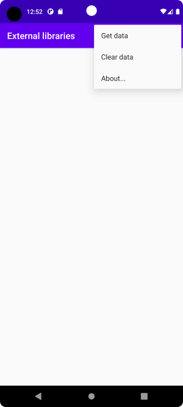

# Rapport

**External libraries**

Jag har löst denna upp genom att utöka programmet jag skrev för att lösa uppgift fem. Precis som det programmet gjorde så hämtar detta program JSON-data om berg ifrån en webbtjänst. Till skillnad från den gamla versionen så läser denna även fältet img i objektet aux, och använder biblioteket Glider för att hämta motsvarande bild. För att hämta data så väljer man menyalternativet "Get data", för att ta bort laddad data väljer man "Clear data".



För att få tillgång till Glider-biblioteket behövdes följande tillägg göras till app/build.gradle

```
/* needed for glide */
repositories {
    google()
    mavenCentral()
}

dependencies {
    ...
    implementation 'com.github.bumptech.glide:glide:4.15.1'// needed for glide
    ...
}
```

Varje objekt i JSON-datan utgör ett berg, och svarar mot ett objekt av typen Mountain i vårt program. Varje JSON-objekt innehåller ett subobjekt aux som innehåller två url:er, en till en Wikipediasida om berget, och en till en bild som Wikipediasidan visar. Följdaktligen representeras aux av klassen Wikidata som finns med i klassen Mountain i form av en medlemsvariabel med namn aux. Strängvariabeln img behövde läggas till i Wikidata då img i JSON-objektet inte avändes i det tidigare projektet. 

För att visa bilden som img pekar ut så behövde ett antal åtgärder vidtas. En ImageView behövde läggas till i recycler_layout.xml 

```
 <ImageView
        android:id="@+id/mountainimage"
        android:layout_width="match_parent"
        android:layout_height="wrap_content"
        android:adjustViewBounds="true"
        android:layout_margin="10sp"/>
```

Den behövde sedan instantieras i MountainViewHolder

```
public static class MountainViewHolder extends RecyclerView.ViewHolder {

    TextView mountainName;
    TextView mountainLocation;
    TextView mountainHeight;
    TextView mountainWiki;
    ImageView mountainImage; // we now also have an ImageView in the ViewHolder

    public MountainViewHolder(@NonNull View itemView) {
        super(itemView);
        mountainName = itemView.findViewById(R.id.mountainname);
        mountainLocation = itemView.findViewById(R.id.mountainlocation);
        mountainHeight = itemView.findViewById(R.id.mountainheight);
        mountainWiki = itemView.findViewById(R.id.mountainwiki);
        mountainImage = itemView.findViewById(R.id.mountainimage); //here we get a reference to it
    }
}
```   
I onBindViewHolder() behöver vi kontrollera om det var någon bild-url associerad med det Mountain-objekt som lästs in ifrån JSON-datan. Om en sådan url finns ska metoden loadImage() anropas, där vi skickar med url:en samt den ImageView som bilden ska visas i.

```
@Override
public void onBindViewHolder(MountainViewHolder holder, int position) {
    String imageUrl = mountainList.get(position).auxdata.getImg();
    holder.mountainName.setText("Name: " + mountainList.get(position).getName());
    holder.mountainLocation.setText("Location: " + mountainList.get(position).getLocation());
    holder.mountainHeight.setText("Height: " + mountainList.get(position).getHeight() );
    holder.mountainWiki.setText("Wiki: " + mountainList.get(position).auxdata.getWiki());

    if( ! imageUrl.isEmpty()){
        loadImage(imageUrl, holder.mountainImage);
    }
```  

Det är i metoden loadImage() som biblioteket Glider kommer till användning och det fungerar översiktligt enligt följande. När man skall ladda hem en bild så generar man först ett RequestManager-objekt med den statiska metoden Glider.with(). RequestManager innehåller medlemsmetoden load(url) med vilken man genererar ett RequestBuilder objekt, detta objekt generar i syn tur ett objekt av typen Request som sköter själva nedladdningen av bilden i en separat tråd. 

I kodsnutten nedan börjar vi med att instantiera ett objekt av typen RequestOptions. Denna klass innehåller alternativ som kan appliceras på det Request-objekt som sedan skall sköta nedladdningen av bilden. Vi använder oss av metoden error() för att specificera en alternativ bild som skall visas om bilden i url:en ej går att ladda ner. Med diskCacheStrategy(DiskCacheStrategy.ALL) så specificerar vi att både den ursprungliga bilden, och eventuella transformerade versioner av bilden skall cachas på disk. Anropet till Glide är något komplext så jag kommer nedan att förklara varje delmoment i anropet. 

1. Vi instantierar ett RequestManager-objekt med Glide.with(context)
2. Vi skapar det RequestBuilder-objekt som skall ladda ned den specificerade url:en med Glide.with(context).load(url)
3. Vi applicerar vårat requestOptions-objekt på det skapade RequestBuilder-objektet med Glide.with(context).load(url).apply(requestOptions), metoden returnerar samma RequestBuilder-instans. 
4. Vi specificerar att den nedladdade bilden skall visas i imageView med Glide.with(context).load(url).apply(requestOptions).into(imageView). Glider biblioteket kommer därefter att börja ladda ned bilden i en egen tråd. 

```
private void loadImage(String url, ImageView imageView){
    // Set RequestOptions for Glide
    RequestOptions requestOptions = new RequestOptions().error(R.drawable.error_image) //if image can't be loaded from url show error_image instead
                                                        .diskCacheStrategy(DiskCacheStrategy.ALL); // Cache both original and resized image
    // Load the image with Glide
    Glide.with(context)              //context of the MainActivity
              .load(url)  
              .apply(requestOptions) //apply specified options to this request
              .into(imageView);      //this is the imageView the image should be shown in
}
```

Närhelst ett Mountain-objekt skall bindas till ett ViewHolder objekt för att visas på skärmen så kommer nu tillhörande bild att bindas till våran ViewHolder och visas tillsammans med all den andra datan vi har fått om det aktuella berget ifrån JSON.

